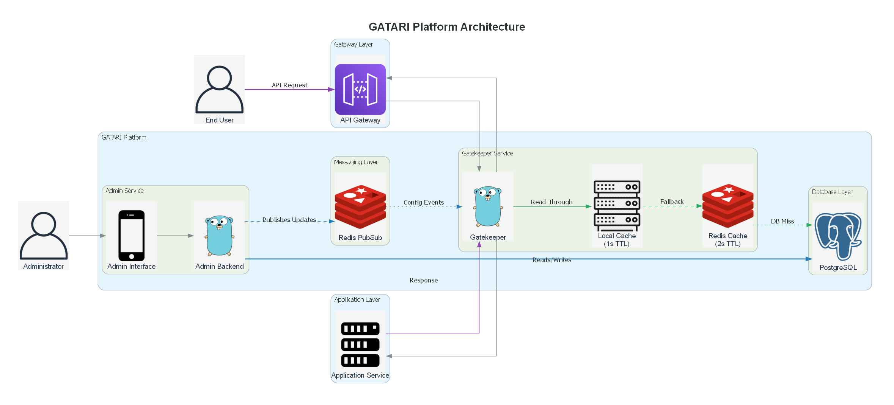

# 🛠️ GATARI: Go Admin & 🚦 GateKeeper

This repository contains two core services of **GATARI** — an all-in-one platform for managing multi-tenancy, subscriptions, and access control.

* **Go Admin**: A multi-tenant backend to manage organizations, subscriptions, resource usage, and billing.
* **GateKeeper**: A lightweight request validation and usage tracking service that integrates with any API backend — as middleware, reverse proxy, or standalone validator.

---

## 📀 Architecture Overview



*This high-level diagram shows how Go Admin and GateKeeper integrate with your APIs, identity providers, cache layers, and databases.*

---

## 🧱 Go Admin

A robust backend service to manage:

* Multi-organization access
* API subscription tiers
* Endpoint-specific pricing
* Fine-grained permission control

### 🔑 Features

* **Multi-Tenancy**: Isolated configurations for each organization.
* **Subscription Plans**: Tiered pricing, quotas, and endpoint-specific access.
* **Billing**: Usage tracking and automated invoicing.
* **Permission Control**: Role-based and resource-level access policies.

---

### 🚀 Getting Started

#### 1. Configure Environment

```bash
cp .env.sample .env
```

#### 2. Build the App

```bash
go mod tidy && \
go mod vendor && \
CGO_ENABLED=0 GOOS=linux GOARCH=amd64 go build -o build/go-admin cmd/go-admin/main.go && \
docker build -t go-admin:latest . && \
rm -f build/go-admin
```

```bash
go mod tidy && \
go mod vendor && \
CGO_ENABLED=0 GOOS=linux GOARCH=amd64 go build -o build/gate-keeper cmd/gate-keeper/main.go && \
docker build -t gate-keeper:latest . && \
rm -f build/gate-keeper
```

#### 3. Run with Docker Compose

```bash
docker-compose up -d
```

#### 4. Access Points

* Admin API Base URL: [http://localhost:8080](http://localhost:8081)
* Gatekeeper API Base URL: [http://localhost:8080](http://localhost:8082)
* Swagger Docs: [http://localhost:8081](http://localhost:8083)

---

## 🚦 GateKeeper Service

A lightweight service that validates requests and tracks usage before hitting your backend.

### ✅ Features

* 🔒 Request validation based on `X-Org-Name` and route
* 📊 Usage tracking (local + Redis + DB)
* 🔁 Three flexible modes:

  * Reverse proxy (`proxy`)
  * Middleware injection (`middleware`)
  * External HTTP validation (`auth-middleware`)
* 🧠 In-memory + Redis caching
* 🔄 Periodic flush to DB
* 🔌 Pluggable serialization (JSON, Protobuf, etc.)

---

## 🔧 Configuration

| Variable          | Required        | Description                                 |
| ----------------- | --------------- | ------------------------------------------- |
| `ENVIRONMENT`     | No              | `dev` (default) or `prod`                   |
| `GATEKEEPER_MODE` | Yes             | `proxy`, `middleware`, or `auth-middleware` |
| `PROXY_TARGET`    | Only in `proxy` | Backend URL to forward requests to          |

---

## 🗺️ Modes of Operation

### 1. 🔁 Proxy Mode

GateKeeper validates and proxies requests to a backend service.

#### Example Config

```env
GATEKEEPER_MODE=proxy
PROXY_TARGET=http://your-backend-service:8080
```

#### Example Request

```bash
curl -H "X-Org-Name: AcmeCorp" http://localhost:8080/gatekeeper/api/v1/data
```

* ✔ Validates org and path
* 🔁 Proxies to `PROXY_TARGET`
* 📊 Tracks usage

---

### 2. 🧹 Middleware Mode

Inject GateKeeper as middleware in your Gin app.

#### Example Config

```env
GATEKEEPER_MODE=middleware
```

#### Example Request

```bash
curl -H "X-Org-Name: AcmeCorp" http://localhost:8080/gatekeeper/users/profile
```

* ✔ Inline request validation
* 📊 Usage tracking if successful

---

### 3. 🌐 HTTP Middleware Mode

Call GateKeeper validation endpoints from your gateway (e.g., NGINX, Kong).

#### Example Config

```env
GATEKEEPER_MODE=auth-middleware
```

#### Endpoints

* `GET /gatekeeper/validate?org=AcmeCorp&path=/api/users`
* `POST /gatekeeper/recordUsage`

#### Example

```bash
curl "http://localhost:8080/gatekeeper/validate?org=AcmeCorp&path=/api/v1/resource"

curl -X POST http://localhost:8080/gatekeeper/recordUsage \
  -H "Content-Type: application/json" \
  -d '{"org": "AcmeCorp", "path": "/api/v1/resource"}'
```

---

## 🧠 Cache Management

GateKeeper includes built-in periodic sync of usage stats:

* ⏱ Local in-memory cache
* 🌐 Redis for distributed consistency
* 📃 Aggregated sync to DB every 30 seconds

### Lifecycle Hooks

```go
// Starts periodic flush
cachemanagement.StartPeriodicFlush(...)

// On shutdown
cm.SyncIncrementalToRedis(...)
cm.SyncAggregatedToDB(...)
```

No manual flushing required — it's handled automatically.

---

## ✅ Health Check

Check if the service is live:

```bash
curl http://localhost:8080/gatekeeper/status
```

```json
{"status": "OK"}
```

---

## 🏑 Running the GateKeeper Service

```bash
GATEKEEPER_MODE=proxy \
PROXY_TARGET=http://localhost:9000 \
go run main.go
```

Or run with Docker and environment variables.

---

## 🔧 Extending GateKeeper

* ✅ Use custom serializers (e.g., Protobuf) in `CacheControllerConfig`
* ✅ Add custom cache keys or metrics in `CacheManagementService`

---

## 📌 Summary Table

| Mode              | Description                          | Backend Required | Public HTTP APIs |
| ----------------- | ------------------------------------ | ---------------- | ---------------- |
| `proxy`           | Reverse proxy with validation        | ✅ Yes            | ❌ No             |
| `middleware`      | Middleware for in-app validation     | ❌ No             | ❌ No             |
| `auth-middleware` | External validation for API gateways | ❌ No             | ✅ Yes            |

---

## 🧑‍💻 Contributions

PRs, ideas, and improvements welcome. Open an issue or reach out on our project Slack!

---